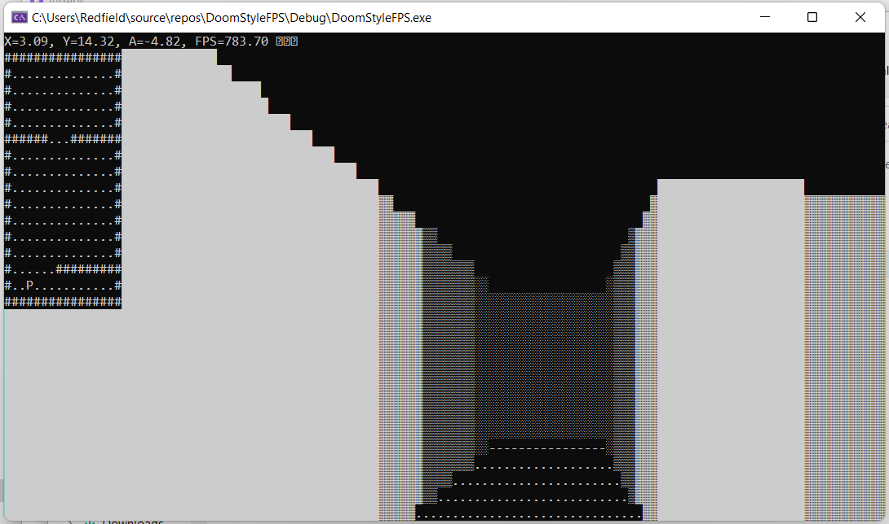
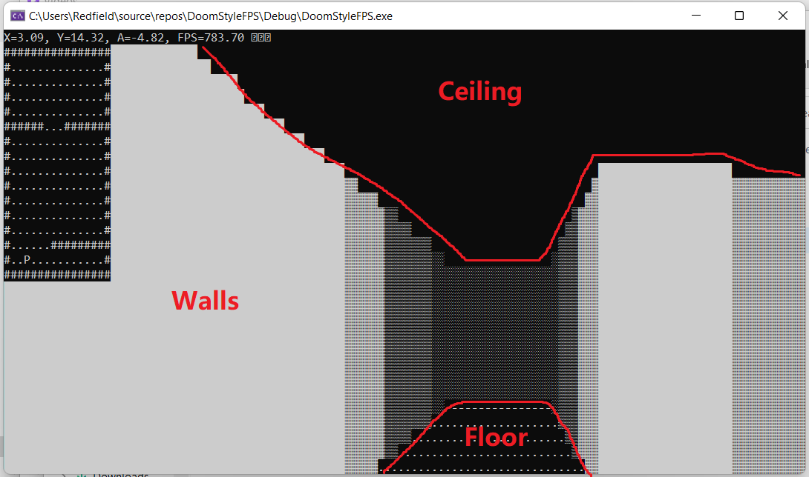
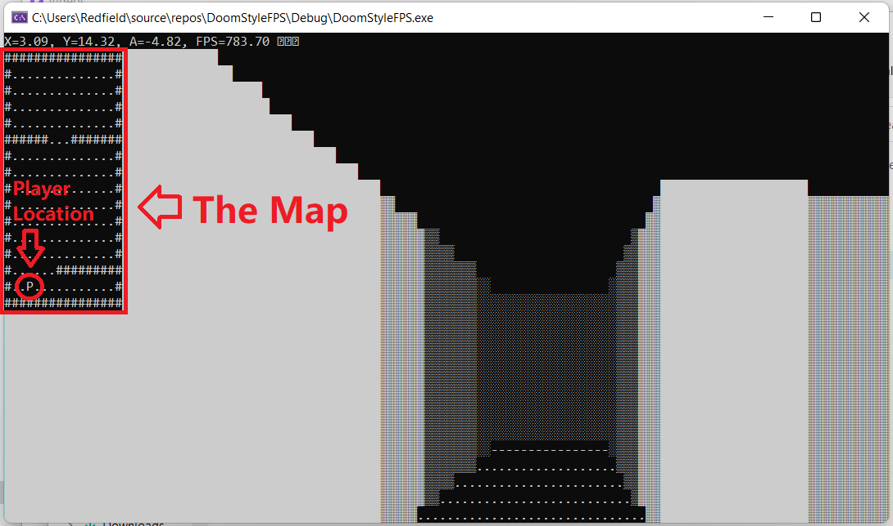

# doomStyleFPS

## Project Overview
This is a Doom-style first person shooter game, in which you can walk around in pseudo 3D space

## What it does
It implements some optics concepts to create a pseudo 3D gaming experience.

In particular,
* You have a first person view of your surroundings which consist of the **the floor**, **the ceiling** and **walls**

* You walk around a simple map with a particular arrangement of walls

* You can press keys **A, S, W, D** to move your character

* You can press the **left and right arrow** keys to turn your camera left or right

Your experience of the world is "pseudo 3D" since the program uses optics concepts to generate 3D-looking walls with certain deformations and colouring differences based on distance. However, your movements are only restricted to 2D movements, like moving forward, backwards and turning sideways

## How I built it
I coded it by following along Javidx9's [First Person Shooter video](https://www.youtube.com/watch?v=xW8skO7MFYw&list=PLrOv9FMX8xJE8NgepZR1etrsU63fDDGxO&index=2). I made some modifications here and there following my own understanding of how the code works, my own preferance and for optimization purposes
  
